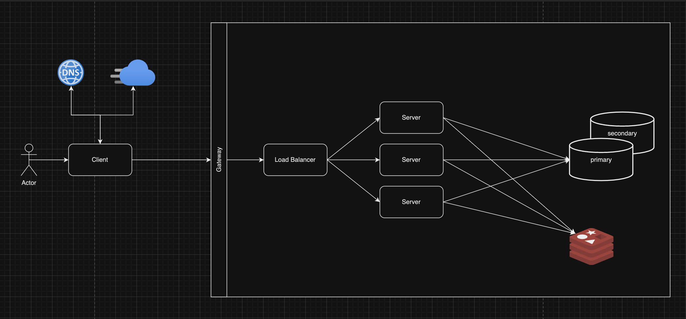

# Real-Time Vocabulary Quiz Coding Challenge

## Overview

Welcome to the Real-Time Quiz coding challenge! Your task is to create a technical solution for a real-time quiz feature for an English learning application. This feature will allow users to answer questions in real-time, compete with others, and see their scores updated live on a leaderboard.

## Acceptance Criteria

1. **User Participation**:
   - Users should be able to join a quiz session using a unique quiz ID.
   - The system should support multiple users joining the same quiz session simultaneously.

2. **Real-Time Score Updates**:
   - As users submit answers, their scores should be updated in real-time.
   - The scoring system must be accurate and consistent.

3. **Real-Time Leaderboard**:
   - A leaderboard should display the current standings of all participants.
   - The leaderboard should update promptly as scores change.

## Challenge Requirements

### Part 1: System Design

1. **System Design Document**:
   - **Architecture Diagram**: Create an architecture diagram illustrating how different components of the system interact. This should include all components required for the feature, including the server, client applications, database, and any external services.
   
   - **Component Description**: Describe each component's role in the system.
     - client: app 
     - cdn: stores user's profile image, ... 
     - gateway: gateway of whole app
     - load balancer: load balancer of quiz service
     - servers: multiple servers of quiz service
     - databases: plan to use postgresql
     - redis: caching user data, quiz data, quiz session data, leaderboard, ...
   - **Data Flow**: Explain how data flows through the system from when a user joins a quiz to when the leaderboard is updated.
      - This maybe internal our app flow
         - Admin -> create question
         - Admin -> create quiz (questions randomly chosen)

      - Admin -> host quiz (this step maybe handle automatically) -> generate unique code 
      - Users join  by code -> open websocket -> wait lobby until admin (or handling automatically by job) start
      - When users answer question -> update user score and leaderboard of quiz -> reflect data by websocket communication
     
   - **Technologies and Tools**: List and justify the technologies and tools chosen for each component.
     - Golang
     - Websocket
     - Postgresql
     - Redis
     - React (for web app using react, maybe native app we using another technology)

### Part 2: Implementation

1. **Pick a Component**:
   - Implement one of the core components below using the technologies that you are comfortable with. The rest of the system can be mocked using mock services or data.

2. **Requirements for the Implemented Component**:
   - **Real-time Quiz Participation**: Users should be able to join a quiz session using a unique quiz ID.
   - **Real-time Score Updates**: Users' scores should be updated in real-time as they submit answers.
   - **Real-time Leaderboard**: A leaderboard should display the current standings of all participants in real-time.

3. **Build For the Future**:
   - **Scalability**: Design and implement your component with scalability in mind. Consider how the system would handle a large number of users or quiz sessions. Discuss any trade-offs you made in your design and implementation.
   - **Performance**: Your component should perform well even under heavy load. Consider how you can optimize your code and your use of resources to ensure high performance.
   - **Reliability**: Your component should be reliable and handle errors gracefully. Consider how you can make your component resilient to failures.
   - **Maintainability**: Your code should be clean, well-organized, and easy to maintain. Consider how you can make it easy for other developers to understand and modify your code.
   - **Monitoring and Observability**: Discuss how you would monitor the performance of your component and diagnose issues. Consider how you can make your component observable.

## Submission Guidelines

Candidates are required to submit the following as part of the coding challenge:

1. **System Design Documents**:
   - **Architecture Diagram**: Illustrate the interaction of system components (server, client applications, database, etc.).
   - **Component Descriptions**: Explain the role of each component.
   - **Data Flow**: Describe how data flows from user participation to leaderboard updates.
   - **Technology Justification**: List the chosen technologies and justify why they were selected.

2. **Working Code**:
   - Choose one of the core components mentioned in the requirements and implement it using your preferred technologies. The rest of the system can be mocked using appropriate mock services or data.
   - Ensure the code meets criteria such as scalability, performance, reliability, maintainability, and observability.

3. **Video Submission**:
   - Record a short video (5-10 minutes) where you address the following:
     - **Introduction**: Introduce yourself and state your name.
     - **Assignment Overview**: Describe the technical assignment that ELSA gave in your own words. Feel free to mention any assumptions or clarifications you made.
     - **Solution Overview**: Provide a crisp overview of your solution, highlighting key design and implementation elements.
     - **Demo**: Run the code on your local machine and walk us through the output or any tests you’ve written to verify the functionality.
     - **Conclusion**: Conclude with any remarks, such as challenges faced, learnings, or further improvements you would make.

   **Video Requirements**:
   - The video must be between **5-10 minutes**. Any submission beyond 10 minutes will be rejected upfront.
   - Use any recording device (smartphone, webcam, etc.), ensuring good audio and video quality.
   - Ensure clear and concise communication.